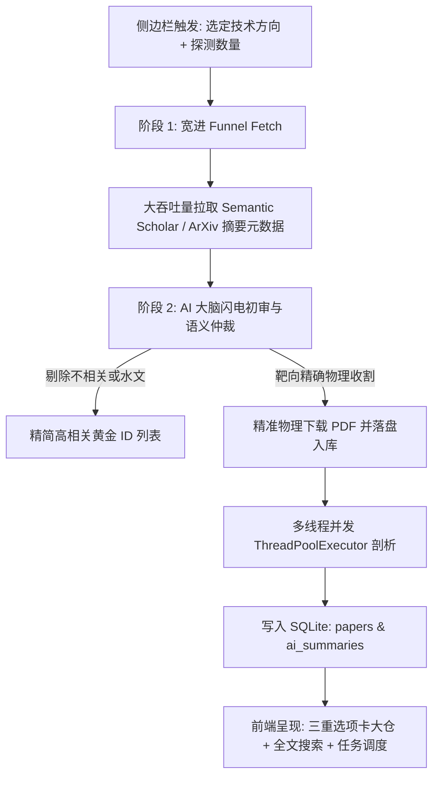
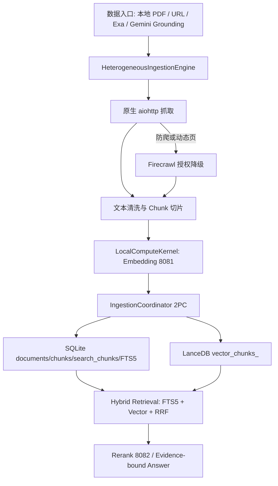

# 🪐 AI 基础设施与软硬件协同 —— 个人智能论文知识库 (Infrastructure AI Radar Hub)

`Infrastructure AI Radar Hub` 是一款针对 **AI 基础设施、异构计算（CPU-GPU/NPU协同）、高带宽互联（CXL/NVLink）以及现代操作系统内核与大模型推理软硬件协同** 研发的下一代 **智能学术研究网关与辩证解构知识库**。

它抛弃了传统检索工具仅靠字面匹配和盲目全量下载的低效模式，首次在工程界引入了**“双阶段漏斗语义初审”**与**“第一性原理科学批判”**机制，搭载高度便携的底层存储引擎与多线程并发任务调度系统，打造出极具奢华视觉美感与工业级稳定性的全自动科研辅助系统。

---

## 🗺️ 架构与双阶段漏斗工作流 (Architecture & Workflow)

本项目基于 **Python + Streamlit + SQLite** 构建，结合大语言模型的高维语义理解力，实现从发现论文到生成辩证白皮书的零时延自动化收割：


```mermaid
graph TD
    A[侧边栏触发: 选定技术方向 + 探测数量] --> B[阶段 1: 宽进 Funnel Fetch]
    B --> C[大吞吐量拉取 Semantic Scholar / ArXiv 摘要元数据]
    C --> D[阶段 2: AI 大脑闪电初审与语义仲裁]
    D -- 剔除不相关或水文 --> E[精简高相关黄金 ID 列表]
    D -- 靶向精确物理收割 --> F[精准物理下载 PDF 并落盘入库]
    F --> G[多线程并发 ThreadPoolExecutor 剖析]
    G --> H[写入 SQLite: papers & ai_summaries]
    H --> I[前端呈现: 三重选项卡大仓 + 全文搜索 + 任务调度]
```

### V2 重构架构：统一知识摄取、混合检索与成本熔断

本次重构在保留 V1 `papers` / `ai_summaries` 论文库的基础上，新增了一套面向多来源资产的 V2 知识层。V2 将本地 PDF、arXiv 论文、外部技术博客、每日简报与每周洞察统一沉淀为 `documents + chunks + document_contents`，同时写入 SQLite FTS5 全文索引与 LanceDB 向量索引。


```mermaid
graph TD
    A[数据入口: 本地 PDF / URL / Exa / Gemini Grounding] --> B[HeterogeneousIngestionEngine]
    B --> C[原生 aiohttp 抓取]
    C -- 防爬或动态页 --> D[Firecrawl 授权降级]
    C --> E[文本清洗与 Chunk 切片]
    D --> E
    E --> F[LocalComputeKernel: Embedding 8081]
    F --> G[IngestionCoordinator 2PC]
    G --> H[SQLite documents/chunks/search_chunks/FTS5]
    G --> I[LanceDB vector_chunks_<source_type>]
    H --> J[Hybrid Retrieval: FTS5 + Vector + RRF]
    I --> J
    J --> K[Rerank 8082 / Evidence-bound Answer]
```

V2 核心模块说明：

- `core/api_clients.py`：异步外部与本地算力客户端，包含 Exa、Firecrawl、本地 Embedding `8081` 与 Reranker `8082`。
- `core/ingestion.py`：统一摄取入口。`HeterogeneousIngestionEngine` 负责 URL 主动抓取，`ingest_pdf_to_v2_sync` 负责将本地 PDF 注入 V2 检索层。
- `core/write_worker.py`：全局 SQLite 串行写队列，开启 WAL 与 `busy_timeout`，用于降低并发写入时的 `database is locked` 风险。
- `core/lancedb_client.py`：LanceDB 向量库封装，默认目录为 `storage/lancedb/`，向量维度为 `1024`，按 `source_type` 分表。
- `core/search_engine.py`：生产级混合检索。先并行召回 FTS5 与 LanceDB 候选，再用 RRF(k=60) 融合，可选本地 rerank 与 LLM 事实绑定回答。
- `core/cost_manager.py`：API 计费审计与硬预算熔断，覆盖 DeepSeek、Google Gemini、Exa、Firecrawl、DashScope。
- `core/orchestrator.py`：每日自动化管线、Gemini Grounding 快讯、Exa 学术打捞、DeepSeek 打分与实体关系抽取的编排层。
- `scripts/migrate_v1_to_v2.py`：将 V1 中已有 AI 解构报告的论文批量迁移到 V2 检索层。
- `scripts/test_pipeline.py`：验证 WriteWorker 并发写入、2PC 回滚和混合检索。
- `scripts/run_golden_benchmark.py`：读取 `config/golden_benchmark.yaml`，对检索质量执行 MRR / Hit@5 回归门禁。

---

## 🌟 核心主打特性

### 1. 🚀 双阶段智能漏斗检索 (Two-stage Semantic Funnel Search)
- **初阶宽进**：以高吞吐量快速从多源学术管道（ArXiv、Semantic Scholar）拉取最新论文候选池（10~30 篇），仅请求 Title 与 Abstract，**绝不盲目下载物理 PDF 文件**，极大地节省网络带宽与磁盘空间。
- **大脑仲裁**：自动调用您选定的“AI 首席科学家大脑”，从第一性原理语义深度识别与当前选定方向强相关的黄金文献，冷酷剔除水文，并实现精准物理物理落盘。

### 2. 💡 首席科学家 AI 辩证剖析报告 (Dialectical Academic Review)
- 提供**“概要 (Summary - 快速学术解构)”**与**“完整 (Detailed - 异构计算硬件深度剖析)”**两档解析精细度：
  - **概要模式**：严格根据第一性原理，点明本质技术痛点、架构机理、进行犀利的冷酷技术批判并评估工程落地价值。
  - **完整模式**：深度拆解微架构级物理开销与访存拓扑、Host 内核与异构算力协同设计、系统级消融实验深度对齐以及未来工程落地与架构复刻白皮书。

### 3. 🔍 全文高亮搜索与相关性排序 (Highlighted Full-Text Search)
- 独家支持针对**已生成的 AI 全景论文剖析报告**进行全文级的高精度关键词检索。
- 采用高级算法，自动计算关键词匹配频次并以降序展示 TOP 10 黄金匹配文献。
- 搜索结果自动抽取上下文匹配片段，并通过精美的黄色高亮卡片（`<span style="background-color: #ffd43b">`）直观呈现。

### 4. ⏰ 智能定时扫描与解构调度系统 (Robust Background Scheduler)
- 底层内嵌多线程轮询守护线程 `RadarSchedulerDaemon`，在保证 Streamlit 界面零阻塞、不卡顿的情况下稳定轮询。
- **任务目标分流**：
  - `📂 物理大仓全盘扫描与分析`：自动检索 `storage/library/` 目录下手动置入的 PDF 文件并登记，自动补全解析报告。
  - `🚀 线上雷达自动探测、下载与分析`：全自动进行线上漏斗检索、AI 仲裁、物理下载及并发解析。
- **任务周期支持**：支持特定时间的“单次预约扫描”与每日固定时刻的“每日重复扫描”。

### 5. 🔌 极度灵活的全局系统配置中心 (Global Control Panel)
- 支持动态配置全局大模型提供商（支持 Gemini 原生多模态大仓与 OpenAI 兼容类型驱动，如 DeepSeek、Qwen 等）。
- sidebar 内置 **“⚡ 测试当前 AI 大脑连通性”** 诊断测试仪，秒级回显 API 连通性、Endpoint 状态以及物理响应延迟。
- 允许配置发送给 LLM 解析的最大并发线程数、单次批量补全的最大论文数。

### 6. 📂 完美的跨设备无缝移植性 (Zero-Config Path Portability)
- 数据库字段防绝对路径污染：对所有新下载的 PDF 论文以 `storage/library/filename.pdf` 相对路径形式保存。
- **动态柔性路径解析器 `resolve_pdf_path`**：当整个项目和已分析的 PDF 大仓被整体拷贝到其它盘符或其它主机上时，系统会自动捕捉原有的遗留绝对路径，智能提取文件名并在本地相对目录下重组，确保无报错、无丢失，一键完美移植。

### 7. 🌐 AI 24小时雷达与技术洞察 (AI 24h Radar & Tech Insight)
- **独立 API 大脑与配置**：支持为强联网简报独立配置专有的 Gemini 密钥与模型（如 `gemini-1.5-pro`），与大仓模型配置（如 `deepseek-v4`）完全隔离，互不影响。
- **双大调度任务自动执行**：
  - **过去 24 小时 AI 领域重点发展简报 (TOP 10)**：每日自动抓取检索。
  - **过去一周 AI 技术深入洞察**：每周在设定时刻对底层数学/硬件/微架构突破执行自动抓取与辩证白皮书归档。
- **树形层级交互式阅读器**：在 Streamlit 中提供以“年/月 > 周数 > 报告类型”为维度的层级化本地 Markdown 归档报告阅读器，并搭载精美的 Glassmorphism Card 容器。

---

## 📦 目录结构说明

```text
research_papers/
├── config/                  # 系统 API 及技术演进注册大仓
│   ├── api_config.json      # 大模型服务提供商及全局控制参数
│   ├── briefing_config.json # 24h 雷达与周报洞察专用配置
│   ├── golden_benchmark.yaml# V2 检索质量回归基准
│   └── research_topics.py   # 定制化的技术演进方向与 Query 映射大表
├── core/                    # 学术大仓调度内核
│   ├── ai_analyst.py        # 首席科学家 AI 大脑交互、诊断与辩证报告生成模块
│   ├── api_clients.py       # Exa / Firecrawl / 本地 Embedding 与 Reranker 异步客户端
│   ├── config_loader.py     # 配置中心加载器与 API 增删改查逻辑
│   ├── cost_manager.py      # API 计费审计、价格规则与硬预算熔断
│   ├── database.py          # SQLite 本地关系存储与动态柔性路径解析器
│   ├── engine_arxiv.py      # ArXiv 论文抓取引擎
│   ├── engine_semantic.py   # Semantic Scholar 顶会级论文抓取引擎
│   ├── funnel_search.py     # 双阶段语义初审与仲裁漏斗管道
│   ├── ingestion.py         # V2 统一摄取、PDF 注入、URL 抓取与 2PC 协调入口
│   ├── lancedb_client.py    # LanceDB 向量索引封装
│   ├── library_scanner.py   # 物理大仓多格式同步与诊断工具
│   ├── orchestrator.py      # 每日雷达、Exa 打捞、LLM 打分与 NER 编排器
│   ├── scheduler.py         # 多线程定时轮询调度器守护内核
│   ├── search_engine.py     # FTS5 + LanceDB + RRF + Rerank 的混合检索引擎
│   ├── weekly_insight.py    # 每周技术洞察生成与归档
│   └── write_worker.py      # SQLite 串行写入队列
├── scripts/
│   ├── migrate_v1_to_v2.py  # 存量 V1 论文迁移到 V2 检索层
│   ├── run_golden_benchmark.py # 检索质量回归门禁
│   └── test_pipeline.py     # V2 写入、回滚、检索流水线测试
├── storage/                 # 数据存储仓
│   ├── lancedb/             # LanceDB 向量子表，按 source_type 分表
│   ├── library/             # 物理 PDF 文件库（由系统自动下载维护）
│   └── radar_hub.db         # SQLite 本地关系型大仓数据库
├── app.py                   # 🪐 Streamlit 全景控制台（主入口点）
└── README.md                # 本文档说明
```

---

## 🛠️ 安装与部署指南 (Installation & Launch)

### 1. 克隆/拷贝项目
将 `research_papers/` 文件夹放置在新机器的任意工作目录下。

### 2. 安装依赖环境
推荐使用 Python 3.10+。在项目根目录下，使用您的包管理器安装以下核心依赖项：

```bash
pip install streamlit requests pypdf google-genai arxiv aiohttp aiosqlite lancedb pyarrow numpy pyyaml url-normalize
```

如果需要启用联网主动打捞与强爬降级，请额外配置环境变量：

```bash
set EXA_API_KEY=你的 Exa Key
set FIRECRAWL_API_KEY=你的 Firecrawl Key
set GEMINI_API_KEY=你的 Gemini Key
set DEEPSEEK_API_KEY=你的 DeepSeek Key
```

本地向量检索建议启动两个 OpenAI 兼容的本地算力服务：

- `http://127.0.0.1:8081/v1/embeddings`：Embedding 服务，模型名默认 `qwen3-embedding`，输出维度需与 `core/lancedb_client.py` 中的 `VECTOR_DIM=1024` 一致。
- `http://127.0.0.1:8082/v1/rerank`：Reranker 服务，模型名默认 `qwen3-reranker`。

如果本地 Embedding 服务未启动，部分摄取路径会降级写入零向量；此时 FTS5 全文检索仍可用，但语义向量召回质量会下降。

### 3. 配置 API Key 与启动
1. 启动 Streamlit 服务：
   ```bash
   streamlit run app.py
   ```
2. 打开浏览器自动弹出的控制台界面，切换到 **“⚙️ 全局系统配置中心”** 选项卡；
3. 配置您首选的 LLM 大脑配置（例如 `deepseek-v4` 或 `gemini-2.5-pro`），填入对应的 API Key（或配置相应的系统环境变量，如 `DEEPSEEK_API_KEY`, `GEMINI_API_KEY`）及 Endpoint URL，点击保存；
4. 回到左侧控制台，点击 **“⚡ 测试当前 AI 大脑连通性”**，显示绿色连通性测试通过后，即宣告大仓彻底打通！

### 4. 手动编辑 `api_config.json` 配置文件说明 (Manual Configuration)
如果您不想在 Streamlit 网页前端进行编辑，也可以直接通过文本编辑器手动配置位于 `config/api_config.json` 的配置文件（若文件不存在，在项目首次运行时会自动初始化生成）。

#### 配置文件参数详解：
```json
{
    "_default_model": "deepseek-v4",               // 系统开机启动时首选的大脑标识 ID
    "_global_settings": {
        "max_concurrent_analysis": 1,              // 最大 LLM 解析并发线程数
        "max_papers_per_batch": 1,                 // 单次批量补全的最大论文并发数
        "analysis_granularity": "detailed",        // 剖析精细度：'summary' (概要) 或 'detailed' (完整)
        "daily_budget": 2.0,                       // V2 商业 API 每日硬预算，单位 USD
        "weekly_budget": 10.0                      // V2 商业 API 每周硬预算，单位 USD
    },
    "gemini-2.5-flash": {                          // 模型唯一标识 ID (Key)
        "name": "Gemini 2.5 Flash (最新多模态极速)", // 前端界面展示的显示友好名称
        "provider": "gemini",                      // API 驱动类型：'gemini' 或 'openai_compatible'
        "model": "gemini-2.5-flash",               // 对应的官方 API 接口实际调用模型名
        "api_key": "",                             // [敏感] 您的 API 密钥。若留空，系统会自动读取对应的环境变量
        "api_key_env": "GEMINI_API_KEY",           // API 密钥对应的系统环境变量备用键名
        "url": ""                                  // 接口 Endpoint URL (Gemini 类型留空即可，OpenAI 兼容类型必填)
    },
    "deepseek-v4": {
        "name": "DeepSeek-V4 (高性能推理)",
        "provider": "openai_compatible",
        "model": "deepseek-v4-flash",
        "api_key": "",                             // 留空代表自动优先读取系统的 DEEPSEEK_API_KEY 环境变量
        "api_key_env": "DEEPSEEK_API_KEY",
        "url": "https://api.deepseek.com/chat/completions"
    }
}
```

> [!TIP]
> **安全推荐：首选环境变量挂载 (Environment Variables First)**
>
> 我们强烈推荐您将各模型配置中的 `"api_key"` 字段留空 `""`，并通过设置操作系统环境变量（如 `DEEPSEEK_API_KEY` 或 `GEMINI_API_KEY`）来动态挂载您的私密密钥。这样即便将来不小心修改了 Git 忽略规则，您的 API Key 依然处于极高的安全隔离状态！

---

### 5. 手动编辑 `briefing_config.json` 配置文件说明 (AI Briefing Configuration)
为了将**大仓**与**24小时雷达与技术洞察**模块的 API 密钥及调度配置进行完全隔离，本系统设立了独立的简报配置文件 `config/briefing_config.json`。您可以手动创建或通过网页前端的折叠配置面板自动更新。

#### 配置文件参数详解：
```json
{
    "gemini_api_key": "",                     // 专属 Gemini API 密钥。若留空，系统会自动读取系统全局环境变量 GEMINI_API_KEY
    "model_name": "gemini-2.5-flash",         // 联网简报专用分析大脑，支持："gemini-2.5-flash" 或 "gemini-2.5-pro"
    "daily_briefing_time": "09:00",           // 每日 AI 进展简报的自动抓取运行时间点 (格式 HH:MM)
    "weekly_insight_time": "10:00",           // 每周 AI 技术深入洞察的自动抓取运行时间点 (格式 HH:MM)
    "weekly_insight_day": "Monday",           // 每周 AI 洞察在每周的星期几触发 (支持 "Monday", "Tuesday" 等英文全称)
    "auto_scheduled": true                    // 是否开启后台常驻定时轮询抓取任务守护 (true/false)
}
```

---

## 🧭 V2 使用说明

### 1. 初始化数据库
首次运行 Streamlit 会自动调用数据库初始化逻辑；也可以通过任意会导入 `core.database.init_db` 的脚本触发表结构创建。V2 会新增以下核心表：

- `documents`：统一资产元数据与状态机，`source_type` 支持 `arxiv_paper`、`local_pdf`、`ext_blog`、`daily_brief`、`weekly_insight`。
- `chunks`：文档物理切片正文。
- `search_chunks` 与 `unified_knowledge_fts`：FTS5 全文检索物化表与虚拟索引。
- `document_contents`：全文 Markdown、AI 摘要、结构化 takeaway 与证据 JSON。
- `entity_lexicon` / `entity_relations`：轻量知识图谱实体与关系。
- `quota_ledger` / `provider_pricing_rules`：API 成本流水与价格规则。
- `ingestion_errors`：2PC 摄取失败与回滚日志。

### 2. 迁移 V1 存量论文到 V2
已有 `papers + ai_summaries` 的旧论文不会丢失。执行迁移后，系统会把已生成 AI 解构报告的论文注入 V2 检索层：

```bash
python scripts/migrate_v1_to_v2.py --dry-run
python scripts/migrate_v1_to_v2.py --batch-size 5
```

常用参数：

- `--dry-run`：只统计待迁移文献，不写入数据库。
- `--batch-size 5`：控制每批处理数量，避免本地 Embedding 服务过载。
- `--sleep 1`：每篇之间等待 1 秒。
- `--skip-embedding`：脚本参数已保留；当前迁移实现仍通过 `ingest_pdf_to_v2_sync` 执行，Embedding 服务不可用时会自动降级零向量。

迁移完成后，新产生的 AI 解构结果会自动尝试注入 V2，无需重复迁移同一批存量数据。

### 3. 主动抓取 URL 并沉淀到 V2
在异步上下文中可以直接调用：

```python
from core.ingestion import HeterogeneousIngestionEngine

engine = HeterogeneousIngestionEngine()
result = await engine.execute_intelligent_active_pull(
    discovery_query="url: https://example.com/technical-post",
    user_confirmed_firecrawl=True,
    source_type="ext_blog",
)
print(result)
```

流程会先尝试原生 `aiohttp` 抓取；如果页面需要动态渲染或遭遇防爬，并且 `user_confirmed_firecrawl=True`，再调用 Firecrawl 付费强爬。所有付费调用会进入 `quota_ledger`，并受 `daily_budget` / `weekly_budget` 熔断保护。

### 4. 使用混合检索与证据绑定问答
V2 检索入口位于 `core/search_engine.py`：

```python
from core.search_engine import api_search

result = await api_search(
    query="CXL KV Cache offloading latency",
    filter_type=["local_pdf", "arxiv_paper"],
    routing_mode="retrieve_rerank_answer",
    model_id="qwen3.7-max",
)
```

`routing_mode` 支持：

- `retrieve_only`：仅返回 FTS5 + LanceDB + RRF 融合候选。
- `retrieve_rerank`：在候选基础上调用本地 `8082` reranker 重排。
- `retrieve_rerank_answer`：取精排证据喂给配置的大模型，生成带 `doc_id` 证据绑定的回答。

### 5. 运行核心流水线测试
```bash
python scripts/test_pipeline.py
```

该脚本会验证：

- `WriteWorker` 50 个并发写入任务是否能串行提交。
- `IngestionCoordinator` 在 LanceDB 写入失败时是否能将 SQLite 状态回滚为 `failed` 并记录 `ingestion_errors`。
- FTS5 + LanceDB 混合检索是否能召回测试切片。

### 6. 运行 Golden Benchmark 回归门禁
```bash
python scripts/run_golden_benchmark.py
```

该脚本读取 `config/golden_benchmark.yaml`，对检索质量计算 MRR、Hit@5、Precision、Recall 与 F1。当前门禁阈值为：

- `MRR >= 0.75`
- `Hit@5 >= 0.80`

运行前请先完成 V1 到 V2 迁移，并确保 `golden_benchmark.yaml` 中的 `doc_id` 与 `chunk_id` 已存在于数据库。

## 🪐 终极移植指南

本知识库专为**完美移植与离线分享**而设计：
1. **整体打包拷贝**：直接将 `research_papers/` 整体打包复制到新机器或移动硬盘上；
2. **零配置秒级加载**：在新路径下直接终端运行 `streamlit run app.py`；
3. **成果完美继承**：本地 SQLite 数据库、物理大仓的 PDF 文件、以及之前所生成的全部 AI 解构报告将会被自动动态重映射与无阻碍解析！
