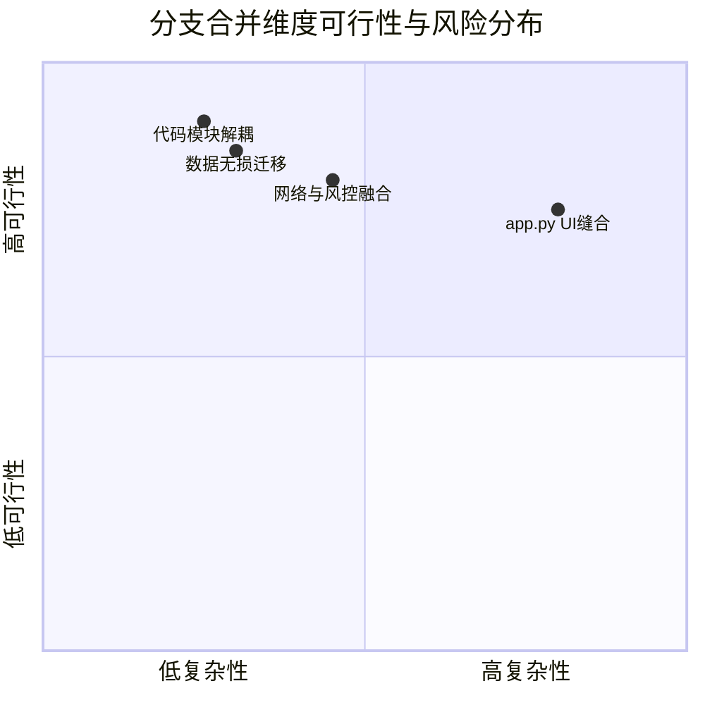

# 🔀 master 与 refactor 分支合并可行性评估与实施方案报告

## 1. 现状与合并背景 (Current State & Context)

代码库 `Infrastructure AI Radar Hub` 的演进轨迹如下：
- **`master` 分支**（在基准提交 `550e07d` 上领先 13 个 commits）：集中在系统鲁棒性修复与 UI/UX 细节增强。包括：大模型配置的 Live JSON 校验与 Custom Payload 支持、`enable_thinking` 深度思考参数控制、网络连通性 Pre-check 与 User-Agent 防阻断、后台运行日志格式化与 UI 自动刷新机制等。
- **`refactor` 分支**（在基准提交 `550e07d` 上领先 1 个大型提交 `2d1ba65`）：完成了底层架构重构。包括：LanceDB 向量数据库集成、2PC 分布式强一致性协调器 (`IngestionCoordinator`)、FTS5 + LanceDB + RRF 混合检索、全局单例写队列 (`WriteWorker`)、全链路 Token 计费审计与硬预算熔断器，以及离线 Benchmark 门禁套件。

为了让系统同时具备 **V2 强硬的底座架构** 与 **V1 极致的网络鲁棒性与 UI 交互体验**，对两个分支进行代码合并具备极其重要的工程意义。

---

## 2. 合并行可行性分析 (Feasibility Assessment)

### 2.1 整体可行性结论
**合并可行性极高（Highly Feasible）**，两分支不存在方向上的对抗，且改动高度互补。

### 2.2 维度评估



1. **底层代码架构解耦性 (100% 可行)**：
   - `refactor` 分支新增的大量核心代码均为全新独立模块（如 `core/orchestrator.py`、`core/lancedb_client.py`、`core/ingestion.py`、`core/search_engine.py`、`core/write_worker.py`、`core/cost_manager.py` 等），与 `master` 不存在任何行冲突，可直接无缝并入。
2. **数据兼容性与无损性 (100% 可行)**：
   - `refactor` 分支已原生内置 `scripts/migrate_v1_to_v2.py` 自动化迁移工具，支持将 `master` 分支的旧表（`papers` & `ai_summaries`）无损提升为 V2 的分布式检索资产（`documents` & `chunks`）。
3. **冲突风险点控制 (中度复杂，可受控解锁)**：
   - 冲突文件仅有 4 个：`.gitignore`、`core/ai_analyst.py`、`core/briefing_manager.py` 和 `app.py`。
   - 所有冲突点在逻辑上均能做到“取长补短”式的平滑缝合，无二选一的对抗性冲突。

---

## 3. 冲突文件缝合细节 (Conflict Resolution Matrix)

| 冲突文件 | `master` 独占变更 | `refactor` 独占变更 | 合并缝合策略 (Resolution Strategy) |
| :--- | :--- | :--- | :--- |
| **`.gitignore`** | 新增常规日志与临时文件忽略 | 新增 `.lancedb/` 和向量临时文件忽略 | **取并集**：合并两端的忽略规则 |
| **`core/briefing_manager.py`** | 增加网络连通性 Pre-check、自定义 User-Agent 请求头、代理与指数退避重试 | 接入 `IngestionCoordinator` 2PC 将生成 Briefing 注入 LanceDB+SQLite | **叠加保留**：以 V2 2PC 写入为骨架，在其 HTTP 请求与网络层包裹 V1 的 Pre-check、User-Agent 与重试机制 |
| **`core/ai_analyst.py`** | 增加 Step-by-step 运行日志、`enable_thinking` 额外参数支持 | 增加 `@api_billing_audit` 计费装饰器与 V2 `document_contents` 保存逻辑 | **叠加保留**：在调用入口保留 V1 的 `enable_thinking` 与详细日志，在底层 API 调用函数添加 V2 的计费审计装饰器 |
| **`app.py`** (UI主控制台) | Custom Payload JSON 校验、UI 实时日志刷新、论文解析状态过滤与删除 | 增加 V2 混合检索与问答 Tab、预算展示控制、V1-V2 增量迁移交互面板 | **模块化缝合**：保留主 UI 骨架，在系统设置中整合 Custom Payload 校验与预算面板；在检索区提供“混合检索 RAG”扩展 |

---

## 4. 落地合并方案与步骤 (Step-by-Step Execution Plan)

### 阶段一：建立融合分支与准备
1. 检出新的融合分支 `master-v2-merge`：
   ```bash
   git checkout master
   git checkout -b feature/master-v2-merge
   ```

### 阶段二：代码层三方合并与冲突处理
2. 执行合并指令，唤起冲突项：
   ```bash
   git merge refactor
   ```
3. 逐个文件精细解决冲突：
   - **`.gitignore`**：合并 `tmp_lancedb/` 等向量仓库路径。
   - **`core/briefing_manager.py`**：将 `master` 中的 `_precheck_network` 和 `User-Agent` Header 逻辑拼接入 `DailyRadarPipeline` 及简报获取链路中。
   - **`core/ai_analyst.py`**：保持 `enable_thinking` 参数穿透，同时加上 `@api_billing_audit` 装饰器。
   - **`app.py`**：保留 master 的 UI 日志高亮与 Live JSON 编辑器，嵌入 refactor 的 RAG 问答卡片与硬预算度量。

### 阶段三：自动化流水线与功能验证
4. **运行流水线功能测试**：
   ```bash
   python scripts/test_pipeline.py
   ```
   *预期结果*：`WriteWorker` 50 并发串行提交无死锁，`IngestionCoordinator` 2PC 回滚功能正常。
5. **数据无损迁移演练**：
   ```bash
   python scripts/migrate_v1_to_v2.py --dry-run
   ```
   *预期结果*：旧 SQLite 论文资产被成功识别并解析为待迁移对象。
6. **Golden Benchmark 自动化校验**：
   ```bash
   python scripts/run_golden_benchmark.py
   ```
   *预期结果*：输出 MRR 与 Hit@5 指标，达标 ($\text{MRR} \ge 0.75$, $\text{Hit@5} \ge 0.80$) 即宣告合并彻底成功！

---

## 5. 预期合并后架构优势 (Post-Merge Benefits)

合并完成后，工程将同时享有：
1. **网络与交互高可靠**（源自 master）：在弱网环境下的网络诊断、用户代理伪装、深度思考参数支持与人性化 Live JSON 校验。
2. **工业级核心数据引擎**（源自 refactor）：2PC 强一致性摄取、BM25 + LanceDB + RRF 混合检索、单例串行写队列与商业 API 硬限额熔断保护。
